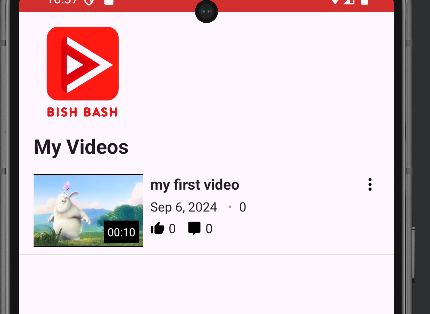
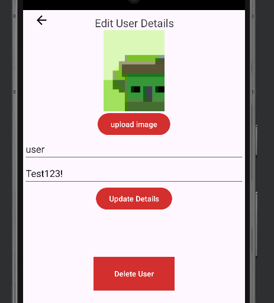

# Start and use the android application

## Run the servers

First you need to run the servers.
Go to your linux environment and open a terminal in the TCP server directory and write "./server.out" to run the tcp server.

Now your TCP server is up and running.
Open a powershell terminal in your server directory and write "npm start" to start the NodeJS server.

## Run the application

Open android studio, choose the device you want to run the application on, and press on the green triangle to start it.
For this demonstration, we will use a pixel 7 Emulator. It might take some time.

When loaded, we will be transferred into the main page

### Create an account

To create an account, we will click on the register icon in the bottom right corner of the navigation bar. It will send us to the sign up page.
Similar to the signing up process in the react app, we will need to fill the fields according to the requirements. These requirements can be seen when holding your finger on the question mark icon next to every field.
In addition, we will have to pick an image either from the gallery or from the camera.

Entering values not according to the requirements will result in a popup message about what needs to be changed. In this example, the username value is 4 letters long instead of 6.

After signing up, we will be send to the main page. You will be able to see your details at the top of the screen.

## Videos and comments demonstration

Now we would like to upload a new video. To do this, we will first have to click the my videos button in the nav bar (The film icon). We can see that my videos page is empty since we have no videos yet. So we will click on upload video to upload our first video.

After filling all of the fields, we will need to pick a video from our gallery. Submitting everything will auto generate a thumbnail for the video. An example for a video being uploaded:

As you can see, after submitting the video, we will go back to my videos page, and we can see our newly added video with it's details

After clicking the video's thumbnail, we will be transferred to the watching page where we can watch our video, like and comment it.

We will click on the like button to like the video, and also open the comment tab by clicking on the show comments button. There we will be able to see the comments on this video and add our own.
At first, there are no comments but by filling the input and submitting it, we will be able to upload our comment

We will watch some other videos to change the default recommendations, so the next person to watch this video, will be targeted to better videos. So first, we will have to search the videos

Now we will log out so we will be able to log in into another user and also comment on this video.
So we will click on the logout button on the right side of the navbar, and we will be sent to the login page. We will log in as admin1.

We will search "my first video" and click it to watch it. We can see that the recommendations have changed because MyUser watched more videos alongside this one, so they are recommended to anyone watching it.

We will open the comment section to also comment on this video. We can see that we don't have the options button next to MyUser's comment because it's not our comment so we can't edit or delete it.
We will comment "What a great video" with a new line after each word, wo the comment would be 4 lines long.
we will be able to see that because it's to long, the content will not shown in it's entirety, so we will have to click read more to read it fully.

Now admin1 want's to edit it's comment, so he will click on the options button and choose edit. It will open a prompt that he will be able to write the new text in it.

Now we will return to MyUser to edit and delete this video.
We will log in again to MyUser and return to my videos, there we can see that the video's views and comments have increased.

Now we will click on the options button on the right side of the video, and we will chose edit.
Here we can change the video's name, description, tags and thumbnail, where the thumbnail can be uploaded from the user's device or by camera.
We will change it's name.

Now we will be sent into my videos, where we can see that it's name is changed.

To delete this video, we will click on the options button next to the video, and choose delete instead of edit. It will delete the video and remove it from the list.

Now, to delete this user, we will enter my videos again and click on the Edit user details button.
Clicking on the delete button will delete the user, and all it's videos, comments and likes.

