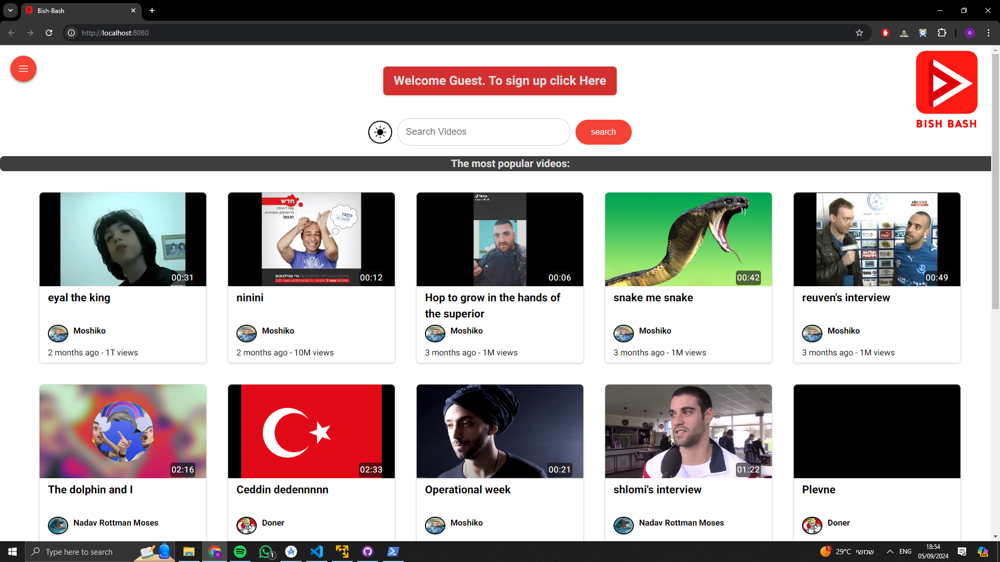

# Start the application

## Run the servers

First you need to run the servers.
Go to your linux environment and open a terminal in the TCP server directory and write "./server.out" to run the tcp server.

Now your TCP server is up and running.
Open a powershell terminal in your server directory and write "npm start" to start the NodeJS server.

Open the url (http://localhost:8080) to start your react application

### Create an account

First, we create a new account. We need to click on the menu button on the left upper side of the page, and click on Sign Up.

Here we will fill up the details of our new account according to the rules of each field. The rules for each field can be seen by hovering over the question mark icon next to it.
After fill the details we will pick a profile picture for our user. If followed the rules, a new account would be created
An example of sending a password that doesn't follow the rules.

After a new account is created, you will return to the main page with your details shown in the top of the page.

## CRUD for videos

Now we would like to upload owr own video. In the menu, we will choose "My videos" to go to our channel and account editing page. In it, we will click on the upload video button to upload our first video.

Fill our video details and choose a video file, to see a preview of it.

Now we need to get a thumbnail for the video. For this, we can choose between capturing a frame from the video or upload a Thumbnail image. For this demonstration we will capture a frame. So, we need to choose the "Catch frame" option, go to the exact frame in the video we want to capture and then click "capture frame for thumbnail". we can see our new thumbnail under this button.

Now we can upload our video. Uploading it will return us to the my video page where we could see the details and commit actions of our new video.

Now we will click on it to watch and comment it.
