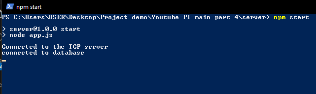
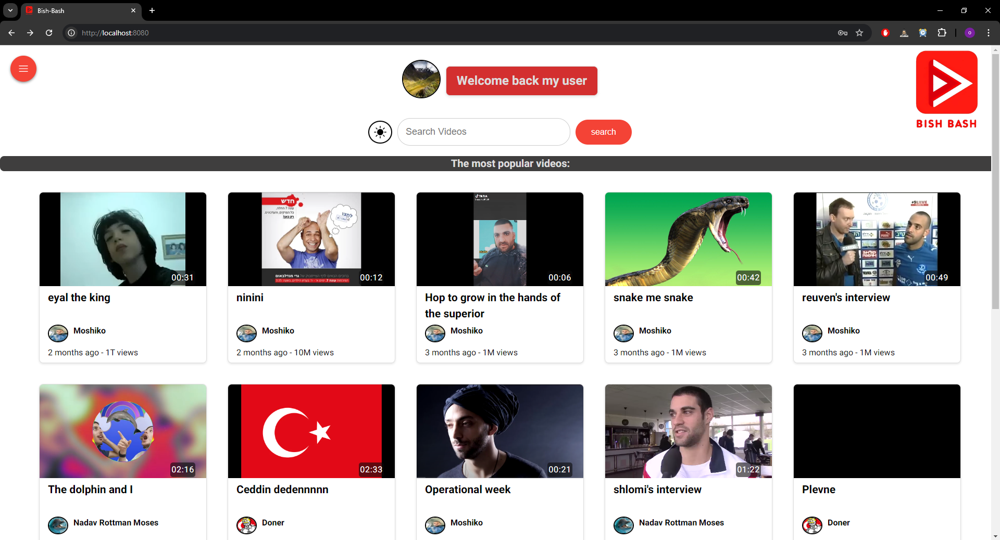

# Start and use the react application

## Run the servers

First you need to run the servers.
Go to your linux environment and open a terminal in the TCP server directory and write "./server.out" to run the tcp server.

Now your TCP server is up and running.
Open a powershell terminal in your server directory and write "npm start" to start the NodeJS server.

Open the url (http://localhost:8080) to start your react application

### Create an account

First, we create a new account. We need to click on the menu button on the left upper side of the page, and click on Sign Up.

Here we will fill up the details of our new account according to the rules of each field. The rules for each field can be seen by hovering over the question mark icon next to it.
After fill the details we will pick a profile picture for our user. If followed the rules, a new account would be created
An example of sending a password that doesn't follow the rules.

After a new account is created, you will return to the main page with your details shown in the top of the page.

## Videos and comments demonstration

Now we would like to upload owr own video. In the menu, we will choose "My videos" to go to our channel and account editing page. In it, we will click on the upload video button to upload our first video.

Fill our video details and choose a video file, to see a preview of it.

Now we need to get a thumbnail for the video. For this, we can choose between capturing a frame from the video or upload a Thumbnail image. For this demonstration we will capture a frame. So, we need to choose the "Catch frame" option, go to the exact frame in the video we want to capture and then click "capture frame for thumbnail". we can see our new thumbnail under this button.

Now we can upload our video. Uploading it will return us to the my video page where we could see the details and commit actions of our new video.

Now we will click on it to watch and comment it.

We clicked on the video and it brought us to the watching page. We will go down to see the comments section and we will add a new comment to this video.

Because this is our comment we can edit and delete it. In addition, if the comment is really long we can expand it to fully see it's content.
Now we will log in from a different account to also comment on this video. So, we need to click the logout button in the menu and enter the other user's details. We will log in as admin1.

We will search for the video and open it.

We can see that the recommendations of this video has changed because admin have previously watched other videos, so these videos have been included to it's recommendation's list.
Now we will comment and like on this video also.

We will go back to My User to edit end delete this video. For that, we will logout from admin1 account, login to My User and return to my videos.
We can see that the details of my first video has changed.
Now, we would like to edit it's thumbnail to a different thumbnail we would upload and change it's description by clicking on the edit button in the video's row.

Now we would click on the Upload Thumbnail option and choose an image, and change it's description, and then, click on the Update Video button.

We would return to the My Videos page and we can see that the details of the video has changed.

To delete the video, we simply click on the trash can icon next to the edit icon and confirm the deletion by writing the video's name in the prompt opened.

Now the video has been removed from the database and it can't be reached.

So, we will delete our user by returning to my videos, and clicking on edit user details.
There we will press the delete user option that would open a prompt and require from us our password as shown:

Now our user has been deleted.
