# Initialize the environment

First, open the github repository, download it and extract the files into an empty directory.

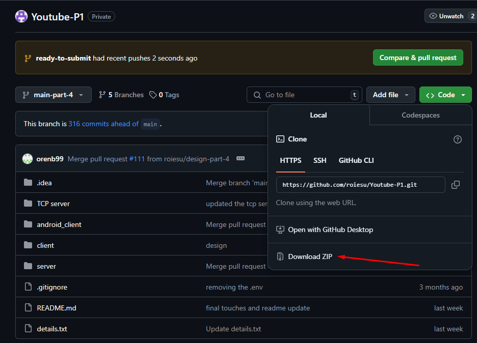
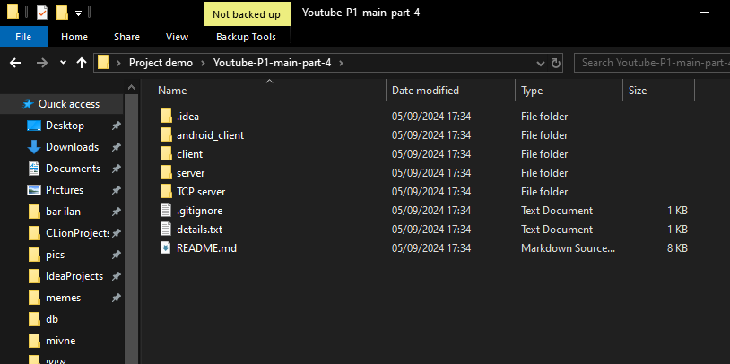

## Init mongodb and the NodeJS server and client

Now, open a powershell terminal, go to the server directory inside your root directory, and write "npm i".
This will allow you to run the NodeJS server.

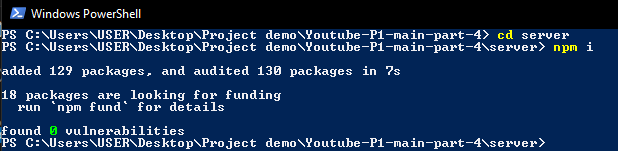

Create a mongodb connection. For this demonstration, we will use a local mongodb server.
Inside that connection create a new database and name it as you like. For this demonstration we will use "Demo". Then, create 3 collections named "users","videos" and "comments".

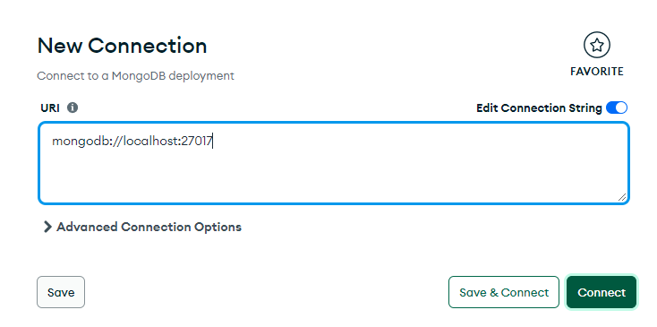
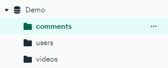

Go back to the server's directory. In there, you can find a db directory. For each collection, there is a built data json file that you can manually seed into your database.
For each collection, press the button import data and choose the json file that corresponds to the collection you are in. For example, for the users collection we will import the
data from the BishBash.users.json file.

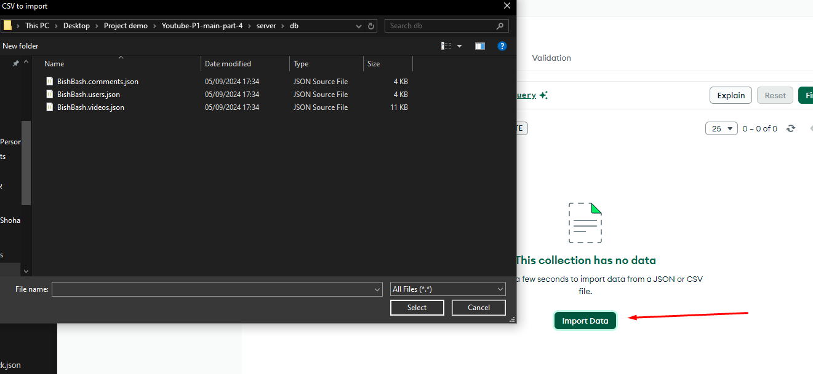

Now, create a file named .env inside your server directory. In it, enter the following text:
JWT_SECRET="(a random text sequence)"
MONGODB_CONNECTION_URL="(The connection string for your mongodb server)"
MONGODB_DATABASE="(Your database name)"
Notice that you replace localhost with 127.0.0.1. For our demonstration it will look like this:

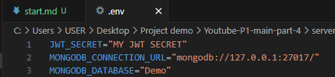

## Init the TCP server

For this part, you will need to open a linux environment. For this demonstration we will use a VM with ubuntu installed in it.
In your linux environment, open the TCP server directory and open a terminal in it. In the terminal write "g++ -o server.out server.cpp" to compile the server file.

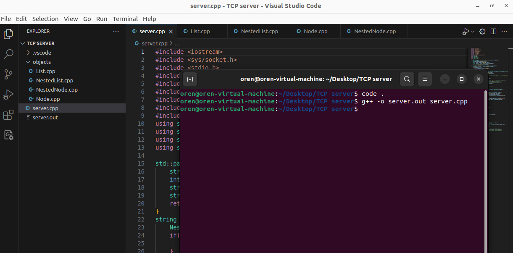

Now, in that terminal write hostname -I to get the linux environment's ip address.
Go back to the .env file in the server directory. Add the following lines to it:
TCP_PORT=5555
TCP_IP="(The linux environment's ip address)"
It should look like this:

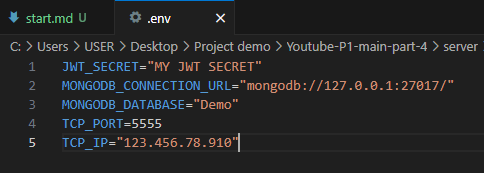

### For running the web application only you can skip to the next wiki react_app.md

## Init the Android application

Open the android_client directory with Android Studio.
First press on the hammer icon to build your project. When it's done, pick your android device, that could be an emulator or your own android device. For this demonstration we will use an emulator.

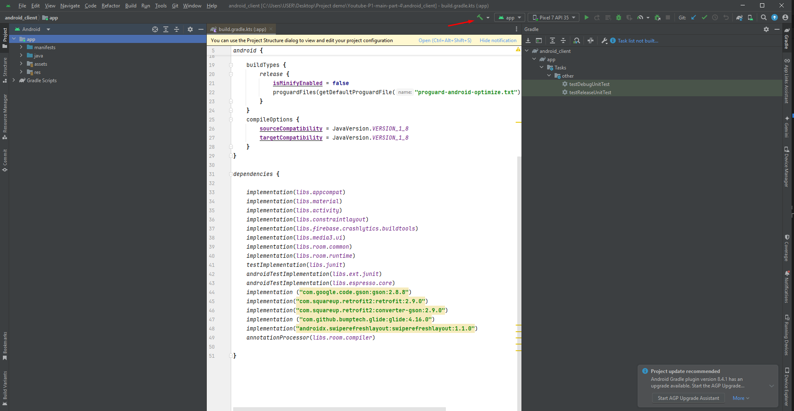
In your terminal, write ipconfig and copy the IPv4 Address under the 2nd section.
Now, open the strings.xml file at this location: "./android_client/app/src/main/res/values/strings.xml"
At lines 26 and 27 replace [ENTER_YOUR_IP_HERE] with the ip address copied:

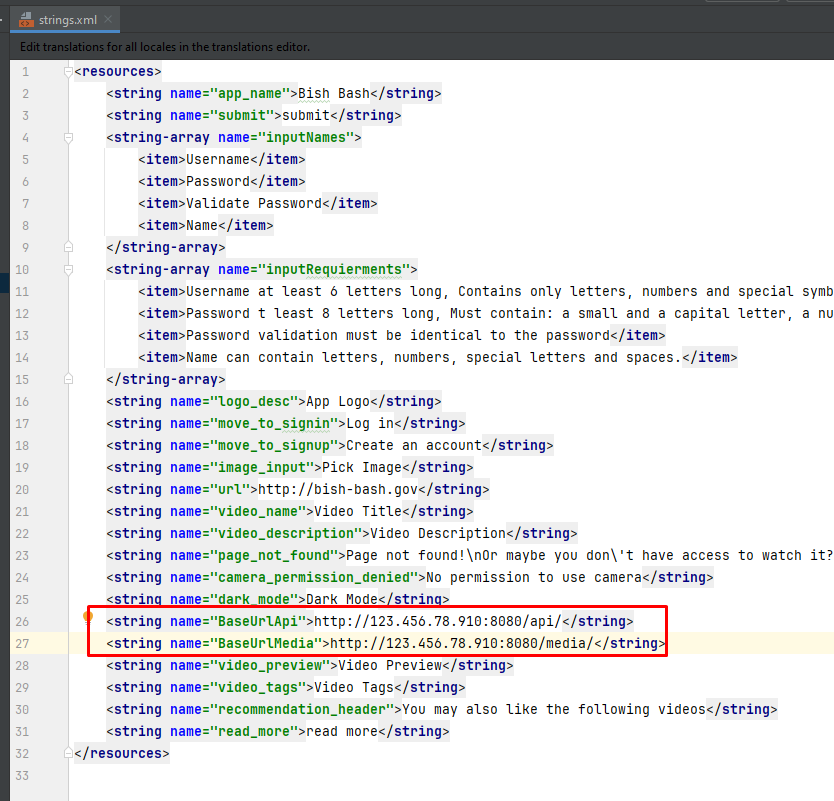

### That's it! Everything is set up. You can jump to the android_app.md wiki to use the app.
